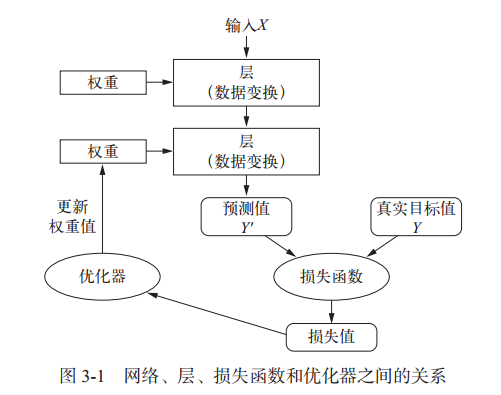
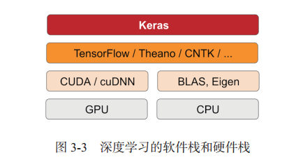
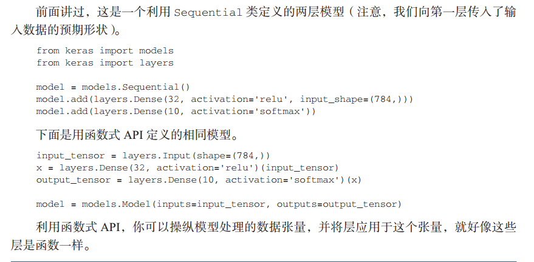

本章包括以下内容：

- 神经网络的核心组件
- Keras 简介
- 建立深度学习工作站
- 使用神经网络解决基本的分类问题与回归问题 

# 3.1　神经网络剖析 

训练神经网络主要围绕以下四个方面：

1. 层，多个层组合成网络（或模型）。
2. 输入数据和相应的目标。
3. 损失函数，即用于学习的反馈信号。
4. 优化器，决定学习过程如何进行。 

## 3.1.1　层：深度学习的基础组件 

层是一个数据处理模块，将一个或多个输入张量转换为一个或多个输出张量。有些层是无状态的，但大多数的层是有状态的，即层的权重。权重是利用随机梯度下降学到的一个或多个张量，其中包含网络的知识。 

不同的张量格式与不同的数据处理类型需要用到不同的层。例如，简单的向量数据保存在形状为 (samples, features) 的 2D 张量中，通常用密集连接层［densely connected layer，也叫全连接层（fully connected layer）或密集层（dense layer），对应于 Keras 的 Dense 类］来处理。序列数据保存在形状为 (samples, timesteps, features) 的 3D 张量中，通常用循环层（recurrent layer，比如 Keras 的 LSTM 层）来处理。图像数据保存在 4D 张量中，通常用二维卷积层（Keras 的 Conv2D）来处理 。

## 3.1.2　模型：层构成的网络 

## 3.1.3　损失函数与优化器：配置学习过程的关键 

**要明智地选择目标函数，否则你将会遇到意想不到的副作用。** 

对于分类、回归、序列预测等常见问题，你可以遵循一些简单的指导原则来选择正确的损失函数。例如，对于**二分类问题，你可以使用二元交叉熵（binary crossentropy）损失函数**；对于**多分类问题，可以用分类交叉熵（categorical crossentropy）损失函数**；对于**回归问题，可以用均方误差（mean-squared error）损失函数**；对于**序列学习问题，可以用联结主义时序分类（CTC， connectionist temporal classification）损失函数**，等等。只有在面对真正全新的研究问题时，你才需要自主开发目标函数。

# Keras 

目前， Keras 有三个后端实现： TensorFlow 后端、 Theano 后端和微软认知工具包（CNTK， Microsoft cognitive toolkit）后端。

推荐使用 TensorFlow 后端作为大部分深度学习任务的默认后端，因为它的应用最广泛，可扩展，而且可用于生产环境。 

典型的 Keras 工作流程

- (1) 定义训练数据：输入张量和目标张量。
- (2) 定义层组成的网络（或模型），将输入映射到目标。
- (3) 配置学习过程：选择损失函数、优化器和需要监控的指标。
- (4) 调用模型的 fit 方法在训练数据上进行迭代。

定义模型有两种方法：一种是使用 Sequential 类（仅用于层的线性堆叠，这是目前最常见的网络架构），另一种是函数式 API（functional API，用于层组成的有向无环图，让你可以构建任意形式的架构）。 

