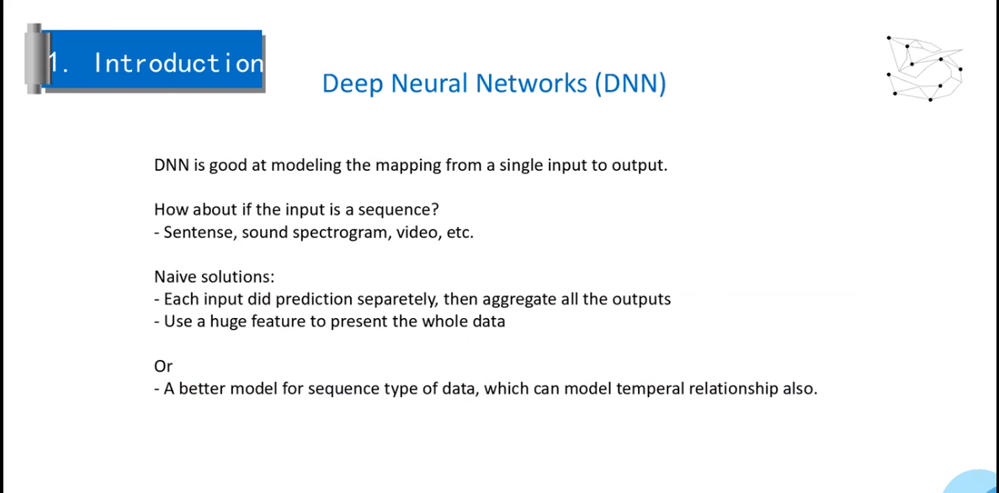
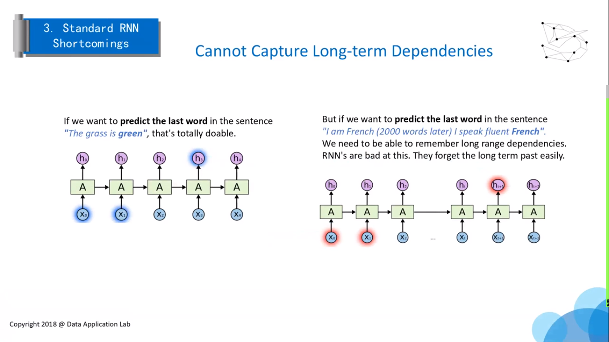
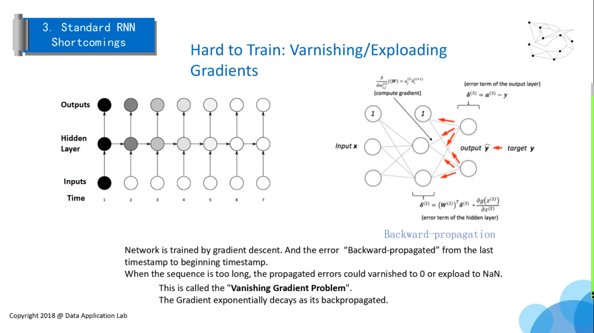
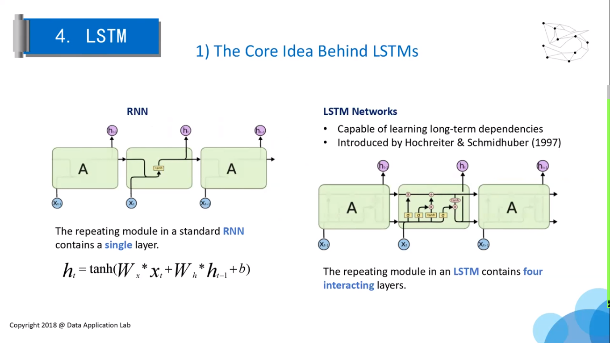
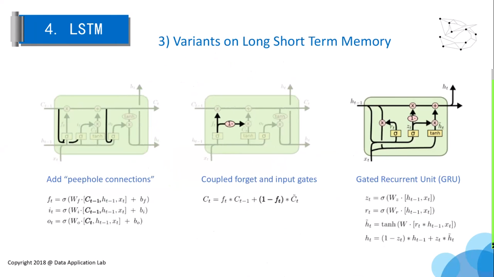
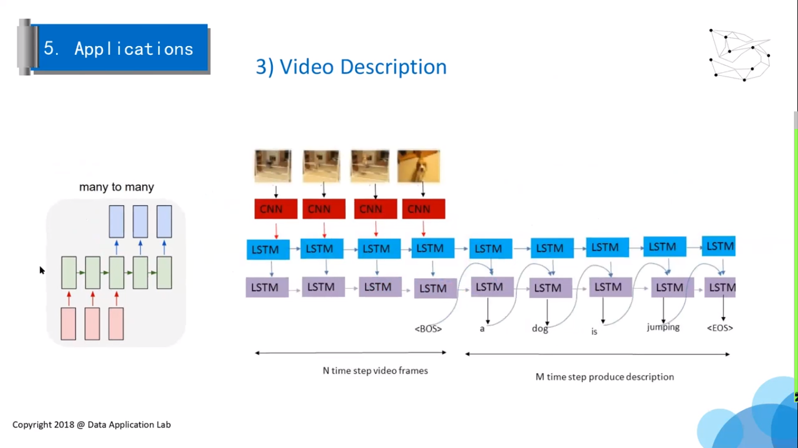
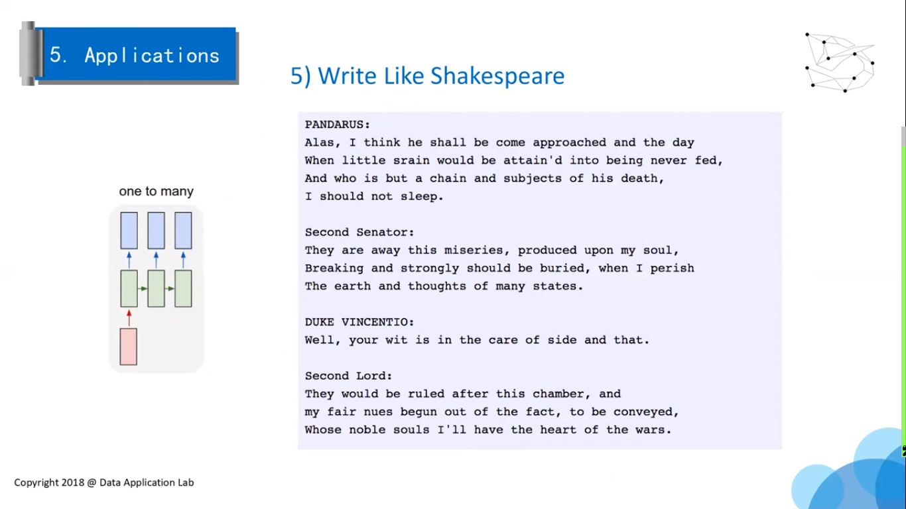
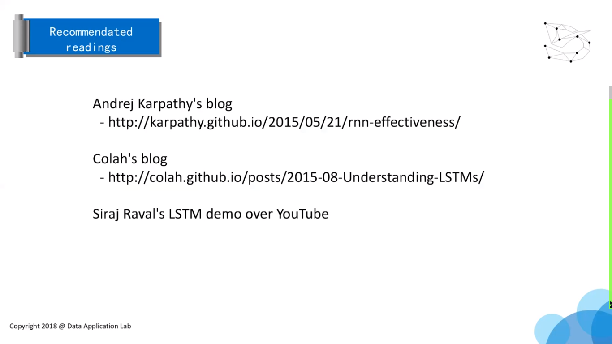

本教程主要简单介绍 LSTM。

# LSTM

## Neural Networks

神经网络的结构

DNN 适合从单输入到单输出映射的建模。

对于是序列（语句、声音、视频）不能很好的处理。

DNN 见到那解决时间序列的方法

- 对每个输入进行预测，最后组合在一起
- 用大量特征代表全部特征

## RNN

t 时刻是输出不仅与当前时刻的输入有关，还与 t-1 时刻有关。

RNN 也可以有很深的结构

RNN 缺点：不能记住很长的序列（记忆距离太短），很难训练（难以很快收敛）

## LSTM

1. Forget gate: t 时刻输入与 (t-1) 时刻的输出进行判断
2. Input gate:
3. The current state
4. Output

$f_t$ 与 $C_{t-1}$ 决定丢弃什么信息

$i_t$ 要保留下来的新信息

$C_t​$ 新数据形成的控制参数

## Application

1. one to many:
2. many to one: 视频分类
3. many to many: 

many to many: 手写识别

描述一个 Video  

读一个视频，看看这个人在干吗

写诗，作曲。

原视频：https://www.bilibili.com/video/av30578651?from=search&seid=5173990614509158284

## Other

LSTM 比较耗内存。

序列的长度：training 是要记住非常长的序列，prediction 序列长度可以长一点。

LSTM：NLP

卷积神经网络：图片处理

Tensorflow 用的比较多，跟你所在的地方用哪一个有关，举一反三，专心学习一个。

公式不用理解得太深，面试可能会涉及到公式推导，具体工作要你知道能解决什么样的问题。

基本知识是帮助你理解的，新问题跟已有的工具的关系。

更多应该关系什么问题，数据规模，神经网络的深度，不太用关心具体怎么实现，因为别人已经吧库写好了。