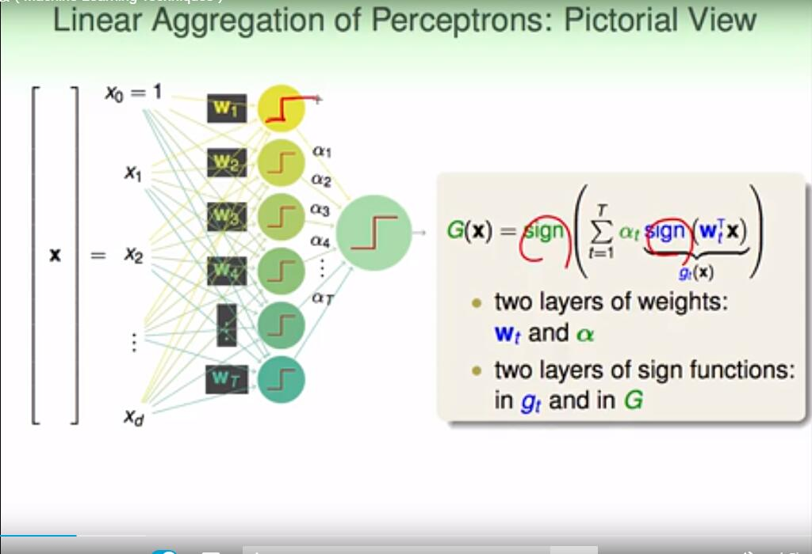
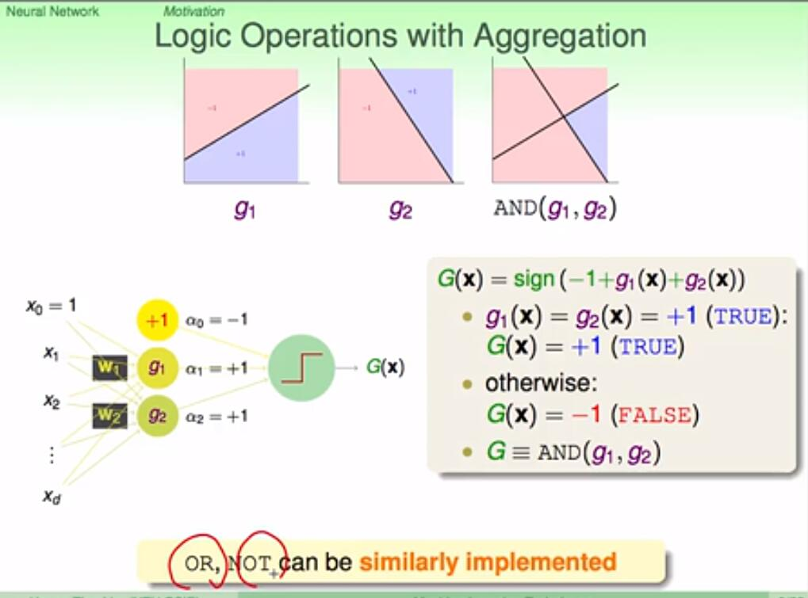
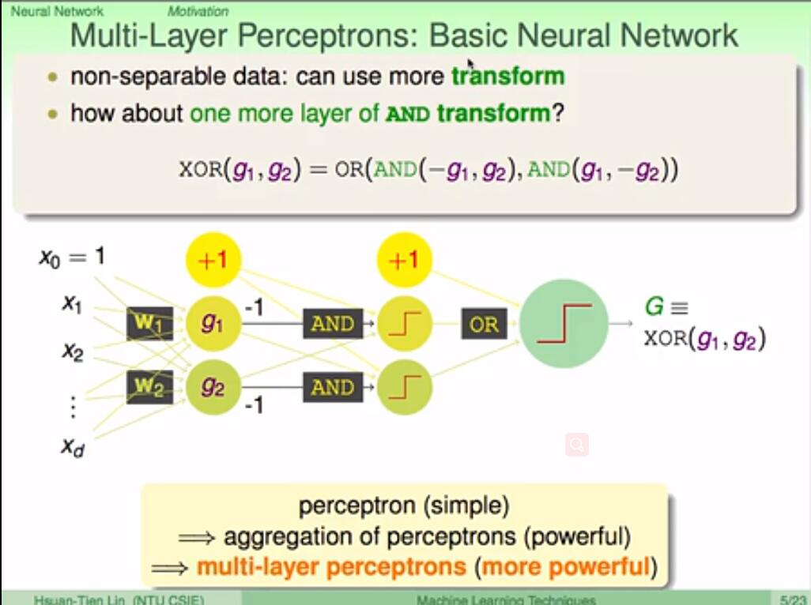
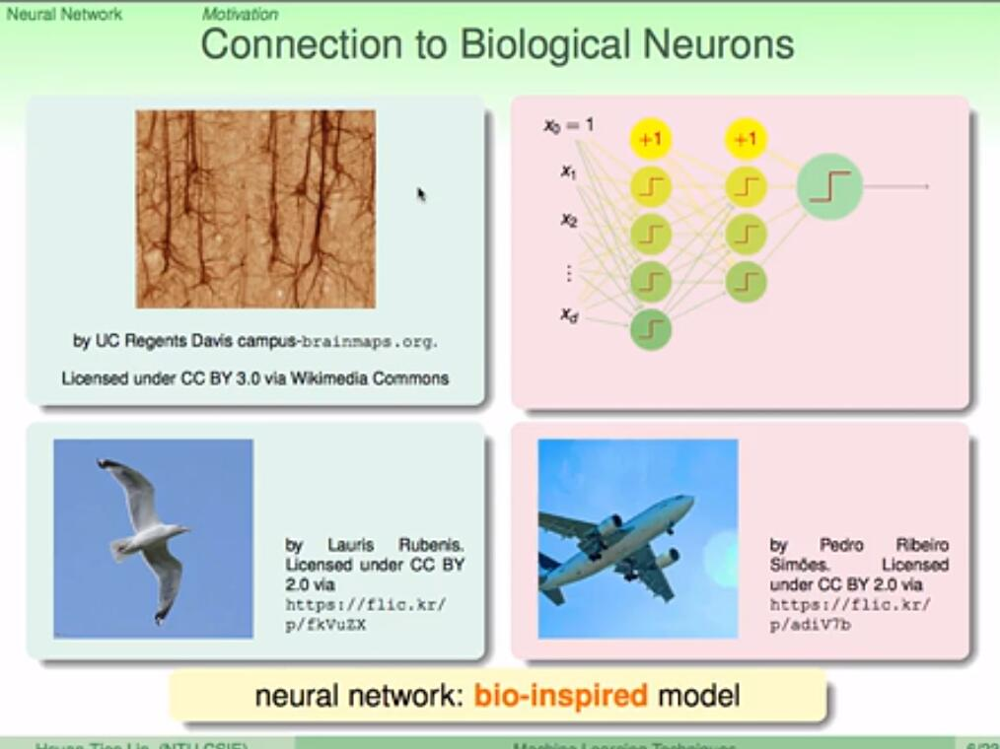
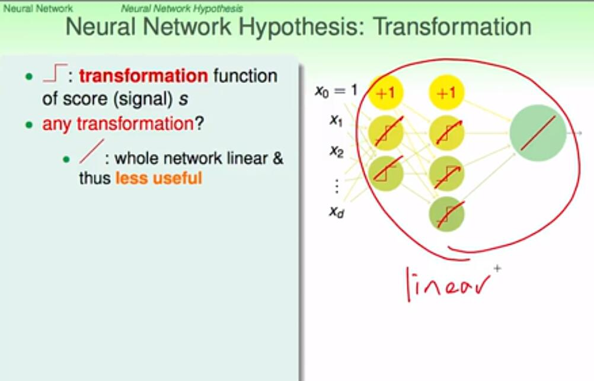
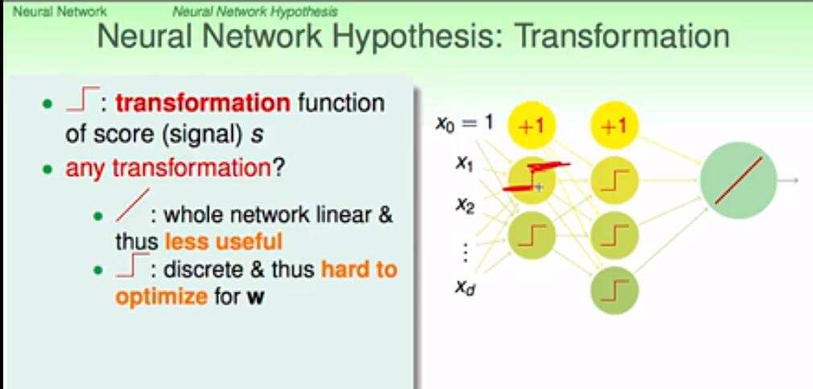

## Motivation

Perceptrons : 感知器

神经网络可以实现复杂的模型

比如，要实现一个 AND 的操作，可以用两个 Perceptrons  线性组合在一起。

我们可以用 8 个、16 个 Perceptrons 或者更多的 Perceptrons 来拟合一个圆边界，但是，如果太多的 Perceptrons  的话，有可能导致过拟合的危险。

上面介绍的是单层感知器的神经网络模型，它无法实现一些更复杂的模型。下面介绍多层感知器。

比如要要实现 XOR 的功能，但是单层感知器是无法实现的，所以引入多层感知器可以实现复杂的非线性模型。这就是基本神经网络的基本模型

神经网络的思想来源于生物的神经网络。

## Neural Network Hypothesis

有三种线性的模型可以运用：linear classification，linear regression，logistic regression 。据具体问题，可以选择最合适的线性模型。如果是binary classification问题，可以选择linear classification模型；如果是linear regression问题，可以选择linear regression模型；如果是soft classification问题，则可以选择logistic regression模型。

在上图中，每一个感知器都要经过一个 transformation function 。针对几个

 transformation function 进行说明：

- 若每个感知器的  transformation function 都是线性函数，那么神经网络最后输出也是线性的，这跟直接使用一个线性模型在效果上并没有什么差异，模型能力不强，反而花费了更多不必要的力气。所以一般来说，中间节点不会选择线性模型。

  

- 如果每个节点的 transformation function 都是阶梯函数（即sign()函数）。这是一个非线性模型，但是由于阶梯函数是离散的，并不是处处可导，所以在优化计算时比较难处理。所以，一般也不选择阶梯函数作为transformation function。

  

- 线性函数和阶梯函数都不太适合作为 transformation function，那么最常用的一种 transformation function 就是tanh(s)。 函数表达式见下图：

  

tanh(s) 函数是一个平滑函数，类似“s”型。当 |s| 比较大的时候，tanh(s) 与阶梯函数相近；当 |s| 比较小的时候，tanh(s) 与线性函数比较接近。从数学上来说，由于处处连续可导，便于最优化计算。而且形状上类似阶梯函数，具有非线性的性质，可以得到比较复杂强大的模型。

神经网络模型：有一点需要注意的是每一层权重 W 的维度：W 的维度是该层感知器的个数 乘 以上一层感知器个数+1

介绍完Neural Network Hypothesis的结构之后，我们来研究下这种算法结构到底有什么实际的物理意义。还是看上面的神经网络结构图，每一层输入到输出的运算过程，实际上都是一种transformation，而转换的关键在于每个权重值 $w_{ij}^{(l)}$ 。每层网络利用输入 x 和权重 w 的乘积，在经过 tanh 函数，得到该层的输出，从左到右，一层一层地进行。其中，很明显，x 和w的乘积 $s_{j}^{(l)}$ 越大，那么 tanh(wx) 就会越接近1，表明这种 transformation 效果越好。再想一下，**w 和x 是两个向量，乘积越大，表明两个向量内积越大，越接近平行**，则表明w和x有模式上的相似性。从而，更进一步说明了如果每一层的输入向量x和权重向量w具有模式上的相似性，比较接近平行，那么 transformation 的效果就比较好，就能得到表现良好的神经网络模型。也就是说，神经网络训练的核心就是pattern extraction，即从数据中找到数据本身蕴含的模式和规律。通过一层一层找到这些模式，找到与输入向量x最契合的权重向量 w，最后再由 G 输出结果。
## Neural Network Learning

主要找出输出与实际值误差与每一层的权重之间的关系。具体的推导见源材料[红色石头博客](https://redstonewill.com/682/) [林轩田机器学习技法](https://www.bilibili.com/video/av36760800/?p=49)

## Optimization and Regularization

神经网络的优化就是让输出误差 $E_{in}(W)$ 达到最小。

当神经网络的层数很多的时候，结构是非常复杂的非线性模型。可能存许多局部最小值，要找到全局最优非常困难。

使用 GD/SGD 算法（With BP）得到的很可能是局部最小值；不同的初始权重也会得到不同的 local minimum。所以权重的选择的技巧有：**选择比较小的值，并且最好是随机选择的**。这是因为较大的初始值在 tanh 函数在两侧比较平缓的位置，此时，梯度很小，每次迭代的变化也非常的微小，很难在全局上得到最优解。而随机选取初始权重可以避免人为因素的干扰，更有可能得到全局最优解。

神经网络的 VC Dimension：对于tanh这样的transfer function，其对应的整个模型的复杂度 $d_{vc}=O(VD)$ 。V 是神经网络中神经元的个数（不包括 bias 点）, D 表示所有权值的数量。所以，如果V足够大的时候，VC Dimension 也会非常大，这样神经网络可以训练出非常复杂的模型。但同时也可能会造成过拟合 overfitting。所以，神经网络中神经元的数量 V 不能太大。

为了防止神经网络过拟合，一个常用的方法就是使用regularization（正则化）。常见的 L2 正则化：$\Omega = \sum(w_{ji}^{(l)})^2$

但是，使用L2 regularizer 有一个缺点，就是它使每个权重进行等比例缩小（shrink）。也就是说大的权重缩小程度较大，小的权重缩小程度较小。这会带来一个问题，就是等比例缩小很难得到值为零的权重。而我们恰恰希望某些权重 $w_{ij}^{(l)}=0$ ，即权重的解是松散（sparse）的。因为这样能有效减少 VC Dimension，从而减小模型复杂度，防止过拟合发生。

为了得到sparse解，有什么方法呢？可以使用 L1 regularizer：但是这种做法存在一个缺点，就是包含绝对值不容易微分。

除此之外，另外一种比较常用的方法就是使用 weight-elimination regularizer。weight-elimination regularizer 类似于L2 regularizer，只不过是在 L2 regularizer 上做了尺度的缩小，这样能使 large weight 和 small weight 都能得到同等程度的缩小，从而让更多权重最终为零。weight-elimination regularizer 的表达式如下：
$$
\sum \frac{(w_{ij}^{(l)})^2}{1+(w_{ij}^{(l)})^2}
$$

除了weight-elimination regularizer之外，还有另外一个很有效的regularization 的方法，就是 Early Stopping 。简而言之，就是神经网络训练的次数 t 不能太多。因为，t 太大的时候，相当于给模型寻找最优值更多的可能性，模型更复杂，VC Dimension 增大，可能会overfitting。而 t 不太大时，能有效减少 VC Dimension，降低模型复杂度，从而起到 regularization 的效果。
$$
E_{in}Ein
$$

$$
E_{test}Etest
$$

随训练次数 t 的关系如下图右下角所示：

## 总结

本节课主要介绍了Neural Network模型。首先，我们通过使用一层甚至多层的perceptrons来获得更复杂的非线性模型。神经网络的每个神经元都相当于一个Neural Network Hypothesis，训练的本质就是在每一层网络上进行pattern extraction，找到最合适的权重 W 最终得到最佳的G 

$w_{ij}^{(l)}wij(l)$。每层网络利用输入x和权重w的乘积，在经过tanh函数，得到该层的输出，从左到右，一层一层地进行。其中，很明显，x和w的乘积$$\sum_{i=0}^{d^{(l-1)}}w_{ij}^{(l)}x_i^{(l-1)}​$$越大，那么tanh(wx)就会越接近1，表明这种transformation效果越好。再想一下，w和x是两个向量，乘积越大，表明两个向量内积越大，越接近平行，则表明w和x有模式上的相似性。从而，更进一步说明了如果每一层的输入向量x和权重向量w具有模式上的相似性，比较接近平行，那么transformation的效果就比较好，就能得到表现良好的神经网络模型。也就是说，神经网络训练的核心就是pattern extraction，即从数据中找到数据本身蕴含的模式和规律。通过一层一层找到这些模式，找到与输入向量x最契合的权重向量w，最后再由G输出结果。