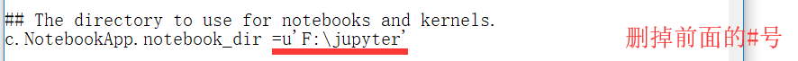
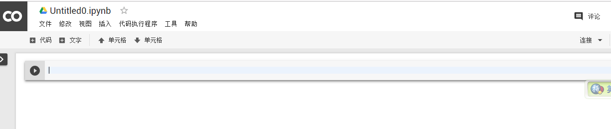
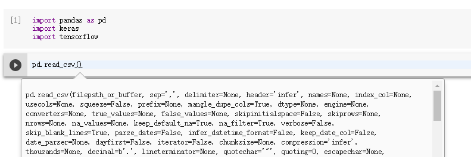
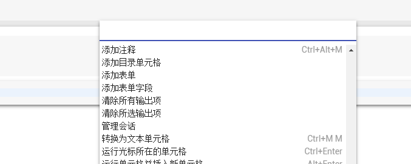
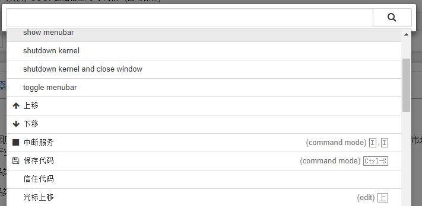

本教程介绍

- 本地搭建  Jupyter notebook 遇到的问题
- 如何在 Google 上搭建 Jupyter notebook 开发环境
- Jupyter notebook 使用技巧

### 本地搭建  Jupyter notebook 遇到的问题

Jupyter notebook 是机器学习的开发利器，集成多语言的编译环境（Python、R  etc.）

#### 本地安装 Jupyter notebook

在本地环境中要搭建 Jupyter notebook 只需安装 Anaconda 即可，其也内置了大部分机器学习所需要的包，自己在安装过程中主要遇到以下的问题：

修改初始的文件路径：

- 打开 Anaconda Prompt

- 输入 `jupyter notebook --generate-config`

- 打开此路径下的文件（每个人路径应该不一样）

- 找到

  ```\# The directory to use for notebooks and kernels.
  # The directory to use for notebooks and kernels.
  #c.NotebookApp.notebook_dir = ''
  ```

- 修改为
- 
- 注意：注意：利用文本修改的时候，编码有问题，保存时选择另存为 编码 utf-8（建议使用 **Notepad++** 编辑器）

### 如何在 Google 上搭建 Jupyter notebook 开发环境

- 拥有一个 Google 账号，登录

- 打开 Google 选择云端硬盘

  

  - 点击新建

    

  - 

  - 搜索并找到 **Colaboratory**，然后关联。

    

  - 新建一个文件夹，并选择 **Colaboratory**  ，一个漂亮的界面就出来了

    

    

- 集成了大部分机器学习的包，还会进行联想

  


### Jupyter notebook 使用技巧

- **Ctrl + shift + P** :显示快捷键，本地 jupyer 和 Google 云端都有

  

- 

- 


参考资料

[1] https://redstonewill.com/1493/

[2] http://liuchengxu.org/pelican-blog/jupyter-notebook-tips.html

