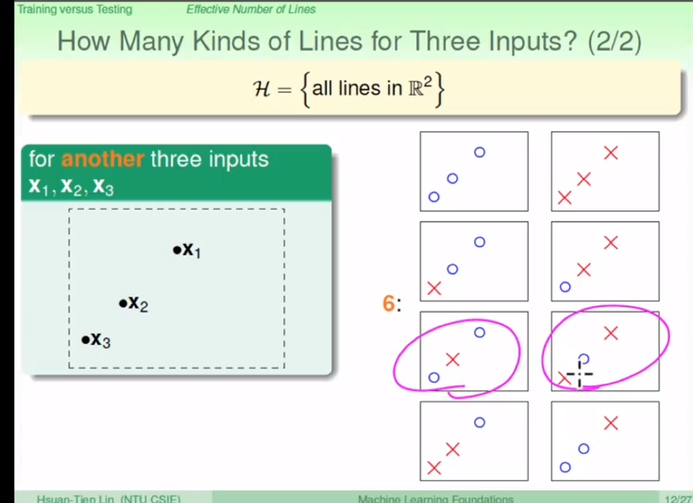
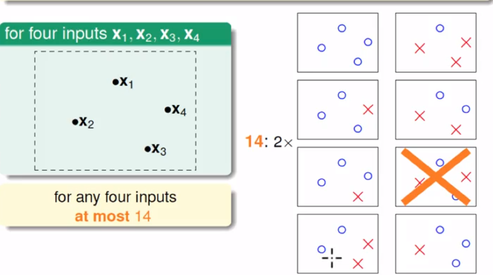

如果 hypothesis 的个数是有限的，且样本数据足够大，那么机器学习是可行的。

# Recap and Preview

上图是基于统计学的机器学习流程图

unknown P on X :表示所有数据样本来自于一定统计学规律的数据。训练样本 D 和最终测试 h 的样本都是来自同一个数据分布，这是机器能够学习的前提。

$E_{in}$ :表示在训练样本上错误的分数，$E_{out}$ 表示在训练样本以外错误的分数。机器学习做的事就是，在训练样本上面学习一个 hypothesis 使得训练样本上的误差尽可能的小，但是重要的是要在要能在训练集以外的样本上误差得到最小，这样机器学习才有意义。

机器学习的两个核心问题：

- $E_{in}(g)\approx E_{out}(g)$ 两者尽可能的相近

- $E_{in}(g)$ 足够的小

  

在上面的证明说道：只要 M 较小， N 足够大，机器学习就是可行的。但是

- 若 M 较小，的确能符合第一个条件$E_{in}(g)\approx E_{out}(g)$，但是不能保证 $E_{in}(g)$ 足够的小，因为 hypothesis 的选择有限。
- 若 M 较大，就是反过来 hypothesis 有足够多的选择，能够确保$E_{in}(g)$ 足够的小，但是另外一个问题就不能保证。

# Effective Number of Line（有效线的条数）

有效线的条数即：在 2-D 平面上，分布着 N （1、2、..）个点，最多用多少条线能将他们分开就是 effective(N) ，如上图的

- 一个点时最多有 2 条线分开（即将点判定为 o 或者 x）
- 两个点最多有 4 条
- 三个点最多有 6 条

- 四个点最多有 14 点（比较通常来说）

  

- 等等，可见 [林轩田机器学习基石课程学习笔记5 — Training versus Testing](https://redstonewill.com/80/)

上面是想说明如果 effective(N)  可以取代我们最初推导的公式中的 M 的话，那么机器学习是可以实现的。

# Effective Number of Hypotheses

上面我们所说的是在二维平面上，能把点分为几种情况，那么，如果在高维度的情况下，我们要怎么进行说明呢？

我们可以把问题转化为：将 X 维度的空间变成 x（叉叉） 和 o（圈圈） 两种情形，能把 x 和 o 分成几种情形。

故，这一节只是多维情形的转化。

# Break Point

上图展示了几种不同的成长函数，成长函数的定义是：由 N 个点组成的不同集合中，某集合对应的 dichotomy (二分类：『就是将空间中的点（例如二维平面）用一条直线分成正类（蓝色o）和负类（红色x）』) 最大，那么这个 dichotomy 值就是 $m_H(H)$，它的上界是 $2^N$。

举个例子：平面上有 2 个点，能将他们二分的个数有 4 个，即$2^2$  ; 对于 3 个点，能分开的最多有 6 中（这里不详细说明）。详细可见

[林轩田机器学习基石课程学习笔记5 — Training versus Testing](https://redstonewill.com/80/)

再来介绍一个概念： Break Point ：定义是满足 $m_H(k) \neq 2^k$ 的 k 的最小值就是 Break Point，上面图中展示了几种成长函数对应的 Break Point。 Break Point 是想说明: Break Point 越小，机器学习的可能性越大

本节主要想说明，在平面上有不同的点分布，能把它们分开的 hypothesis 是有限的。这有就证明，上面的 M 是有限的。